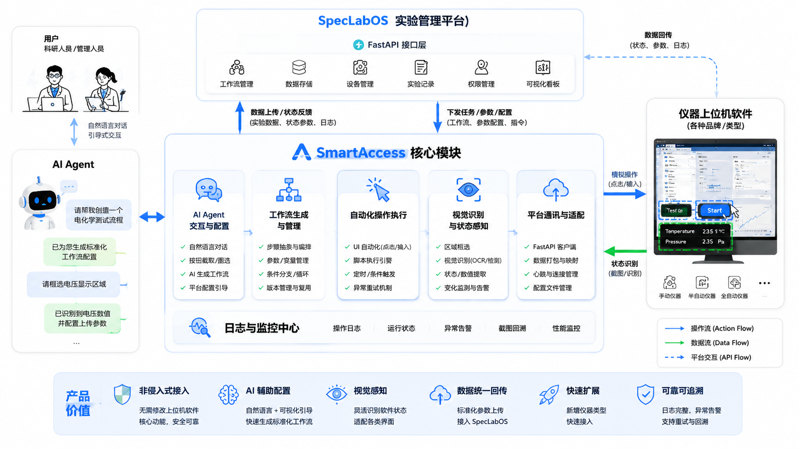

# SmartAccess

<p align="center">
  
</p>

SmartAccess 是一个面向科学仪器上位机软件的非侵入式实验接入与执行助手。它通过 `AI Agent + UI 自动化 + 视觉识别 + 平台适配` 的组合，把原本分散、手工、异构的实验操作流程沉淀为可执行、可回放、可审计的标准工作流。

当前仓库定位为`产品与架构基线`，并已进入桌面端实现阶段，包含完整的 PyQt6 工作台、Win32 真实自动化、PaddleOCR+OpenCV 本地视觉识别、DeepSeek AI 编排和 SpecLabOS 平台对接。

## 产品定位

### 是什么

- 一个运行在实验室侧的桌面执行层，默认按 `PyQt` 桌面端规划。
- 一个连接 SpecLabOS 的非侵入式仪器接入方案，核心依赖 UI 模拟操作、截图感知和结构化数据回传。
- 一个把“仪器接入、工作流设计、状态感知、异常恢复、数据同步”串成闭环的 AI 运行时。

### 不是什么

- 不是直接替代仪器原生控制软件的驱动层或固件层。
- 不是默认要求每台仪器开放 SDK、串口协议或私有 API 的深度集成方案。
- 不是现阶段就承诺支持全部品牌、全部系统、全部自动化能力的通用控制平台。

## 核心价值

- 非侵入式接入：尽量不改动现有上位机软件和实验流程。
- AI 辅助配置：通过 DeepSeek 对话生成标准工作流，配备运行时知识库持续学习。
- 视觉感知补齐接口缺口：PaddleOCR 文字识别、OpenCV 模板匹配、HSV 颜色检测、前景占比存在性检测。
- 真实 UI 自动化：Win32 SendInput/SetCursorPos 驱动点击、输入、快捷键等动作原语。
- 数据统一回传：把状态、参数、日志和异常统一上传到 SpecLabOS。
- 可追溯和可扩展：以模板、契约和评测用例支撑后续仪器扩展。

## 核心文档

- [产品需求文档](docs/PRD.zh-CN.md)
- [技术规格说明](docs/SPEC.zh-CN.md)
- [系统架构总览](docs/architecture/system-overview.md)
- [软件总体设计](docs/architecture/software-design.md)
- [AI 组件设计](docs/architecture/ai-components.md)
- [关键契约与样例](docs/contracts/interfaces.md)
- [功能更新日志](docs/CHANGELOG.zh-CN.md)
- [仓库级 Agent 协作约束](ai/AGENT.md)

## 仓库结构

```text
.
├── README.md
├── resource/
│   └── icon.png
├── docs/
│   ├── PRD.zh-CN.md
│   ├── SPEC.zh-CN.md
│   ├── CHANGELOG.zh-CN.md
│   ├── architecture/
│   │   ├── system-overview.md
│   │   ├── software-design.md
│   │   └── ai-components.md
│   └── contracts/
│       └── interfaces.md
├── src/smartaccess/
│   ├── bootstrap/          # 依赖注入与桌面启动
│   ├── desktop/            # PyQt6 工作台
│   │   ├── pages/          # 流程引导/校准/工作流/模板库/监控/概览
│   │   ├── shell/          # 主窗口/主题/应用入口
│   │   ├── viewmodels/     # UI 状态与数据绑定
│   │   └── widgets/        # 可复用组件（ROI画布/条件编辑器/时间线等）
│   ├── runtime/
│   │   ├── adapters/       # Win32自动化/PaddleOCR+OpenCV/DeepSeek/SpecLabOS
│   │   ├── application/    # 服务层（校准/工作流/模板/运行/AI知识库）
│   │   └── orchestration/  # 编排器/执行器/观测器/恢复引擎
│   └── shared/
│       ├── config/         # 应用配置
│       ├── contracts/      # YAML契约模型（仪器画像/工作流/运行轨迹）
│       └── events/         # 事件总线与运行时事件
├── tests/
│   ├── contract/           # 契约样例验证
│   ├── integration/        # 服务/编排/外观集成测试
│   └── desktop/            # 桌面冒烟测试
├── workspace/              # 运行时工作区（仪器画像/工作流草稿/模板/AI知识库）
└── ai/
    ├── AGENT.md
    ├── memory/
    ├── skills/
    ├── agents/
    └── harness/
```

### `docs/`

- `PRD.zh-CN.md`：SmartAccess 的规范 PRD 主文件。
- `SPEC.zh-CN.md`：SmartAccess 的技术规格基线。
- `architecture/system-overview.md`：架构图文字化说明。
- `architecture/software-design.md`：软件蓝图与设计决策。
- `architecture/ai-components.md`：AI 组件边界和协作方式。
- `contracts/interfaces.md`：运行时契约、字段含义和最小样例。
- `CHANGELOG.zh-CN.md`：功能更新日志与验证记录。

### `src/smartaccess/`

- `bootstrap/`：依赖注入、提供者装配与桌面启动入口。
- `desktop/`：PyQt6 工作台（6 个页面、QSS 暗色主题、Dock 布局）。
- `runtime/adapters/`：Win32 真实自动化、PaddleOCR+OpenCV 本地视觉、DeepSeek AI 生成器、SpecLabOS HTTP 客户端及对应 stub。
- `runtime/application/`：CalibrationService、WorkflowService、TemplateService、AIRuntimeStore 等服务层。
- `runtime/orchestration/`：Orchestrator 编排器、Executor 执行器、Observer 观测器、RecoveryEngine 恢复引擎。
- `shared/`：应用配置、Pydantic 契约模型（instrument_profile / workflow / run_trace）、事件总线。

### `ai/`

- `memory/`：沉淀稳定知识和长期上下文（产品级 + 仓库级）。
- `skills/`：沉淀可复用执行能力（运行时技能 + 仓库协作技能）。
- `agents/`：运行时代理和仓库协作代理的职责边界。
- `harness/`：运行时装配方式与回归评测基线。

### `workspace/`

- `instruments/`：已校准仪器画像（`instrument_profile.yaml`）。
- `workflows/`：工作流草稿（`draft.yaml`）。
- `templates/`：本地模板副本（`{template_id}/{version}/workflow.yaml`）。
- `ai-runtime/`：AI 运行时知识库（episodes / memory / skills / index.json）。

## 体系总览



上图中的关键关系已经在 [系统架构总览](docs/architecture/system-overview.md) 中文字化，重点包括：

- `Action Flow`：用户意图经 AI Agent 生成工作流，再驱动 UI 自动化执行。
- `Data Flow`：上位机状态、识别结果、运行日志、实验参数回流到 SmartAccess 和 SpecLabOS。
- `API Flow`：SmartAccess 通过 FastAPI 适配层与 SpecLabOS 双向同步任务、参数和执行状态。

## AI 组件分层

### 产品运行时 AI

- `memory/product/`：工作流原语、仪器画像、视觉模式、恢复规则。
- `skills/runtime/`：工作流设计、UI 编排、视觉校准、平台映射、异常恢复。
- `agents/runtime/`：orchestrator、executor、observer、recovery。
- `harness/runtime/`：运行时装配、事件总线、会话边界、审计约束。

### 仓库协作 AI

- `memory/repo/`：项目背景、术语、路线图。
- `skills/repo/`：PRD 维护、架构一致性检查、README 维护、文档同步。
- `agents/repo/`：product-analyst、technical-writer、architecture-steward。
- `harness/evals/`：关键场景回归评测和契约验收。

## 文档同步约束

每次完成会影响产品行为、运行时契约、UI 语义、工作流字段或 AI 组件的改动后，都需要执行项目级 `ai/skills/repo/documentation-sync`：同步更新功能日志、PRD、SPEC、契约说明、README、memory 和相关 skill，避免实现与文档脱节。

## 新增一个仪器接入的最小步骤

1. 在 `docs/contracts/` 明确该仪器的 `instrument_profile`、平台字段映射和预期输出。
2. 在 `ai/memory/product/` 补充仪器画像、界面锚点、状态识别模式和安全限制。
3. 在 `ai/skills/runtime/` 选择或新增对应的工作流设计、视觉校准、平台映射技能。
4. 在 `ai/agents/runtime/` 明确 orchestrator、executor、observer、recovery 的职责分配。
5. 在 `ai/harness/evals/cases/` 新增回归用例，覆盖首次接入、执行、异常和回传。

## VER3 实现特性

- ✅ 真实 Win32 UI 自动化（click/double_click/type/hotkey/press_enter/wait）
- ✅ PaddleOCR 文字识别 + OpenCV 模板匹配 + HSV 颜色检测 + 前景占比存在性检测
- ✅ DeepSeek AI 工作流编排，含秒制强制约束与后处理标准化
- ✅ AI 运行时知识库：pending/approved memory & skill，生成时可检索命中知识
- ✅ 仪器删除（引用预检 + 高风险确认）+ 工作流删除（草稿本地 / 模板云端优先）
- ✅ 观测条件编辑器（source/mode/operator/expected/timeout_seconds/poll_interval_seconds）
- ✅ 状态栏实时显示 Automation / Vision / LLM 提供者模式
- ✅ `wait_until` 真实轮询 + `screenshot_check` 一次性观测判断
- ✅ Provider 独立装配：fail fast 依赖缺失，不静默回退 stub

## 推荐开发顺序

1. 先固化契约：工作流、仪器画像、平台适配、运行轨迹、评测用例。
2. 再实现桌面端基础能力：截图采集、窗口锚点定位、输入事件执行、日志落盘。
3. 接着实现 AI 运行时编排：工作流生成、校准会话、状态观察和恢复策略。
4. 最后补平台闭环：FastAPI 适配、状态上报、模板管理、评测自动化。

## 验证

```bash
# 运行全部测试
python -m pytest tests/ -v

# 启动桌面工作台（需 PyQt6 + opencv-python + paddleocr）
python -m smartaccess
```

## 当前默认假设

- MVP 以 `Windows` 上位机场景为主，`Linux` 支持进入 V1。
- 部署优先考虑实验室内网，可接外部模型，但必须保留本地替代策略。
- 桌面端默认使用真实 Win32 自动化 + 本地视觉识别；测试显式使用 stub。
- 研发工作以”文档先行、契约先行、评测先行”为原则。
